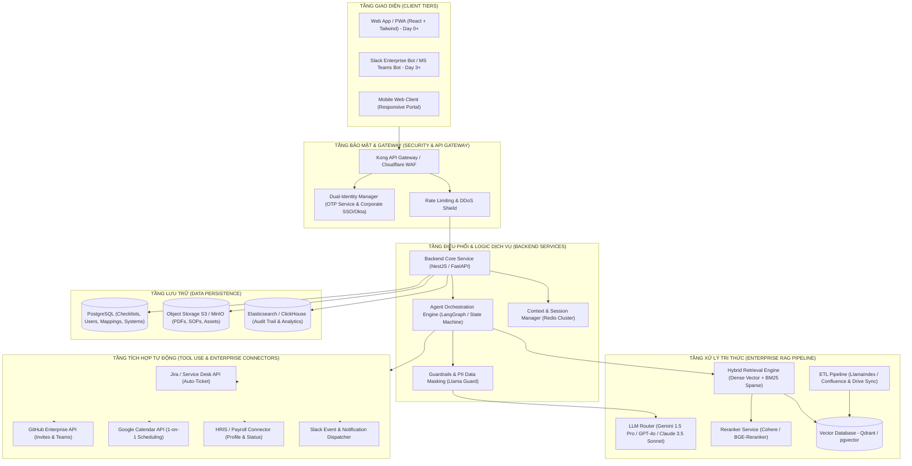
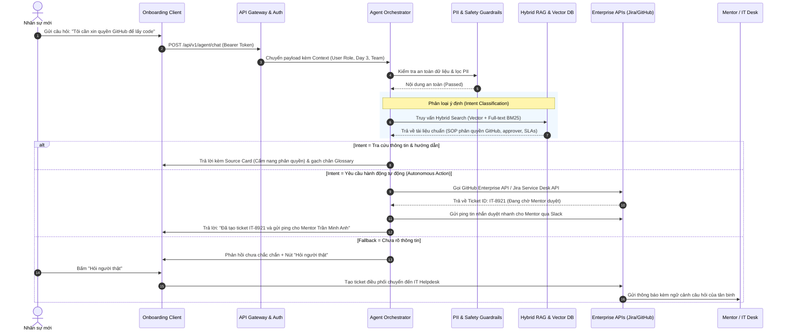
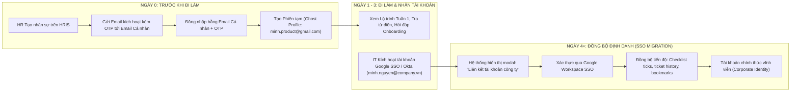
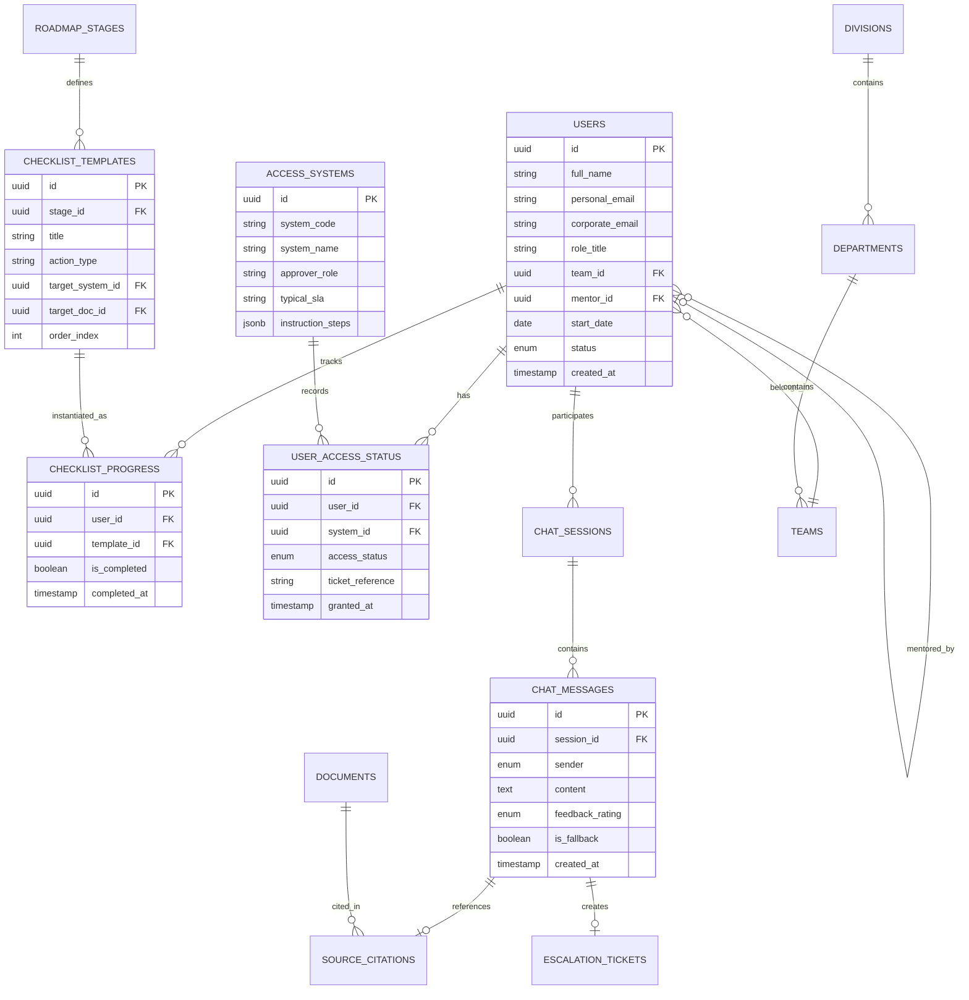
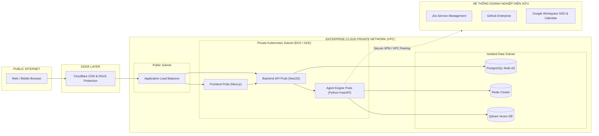
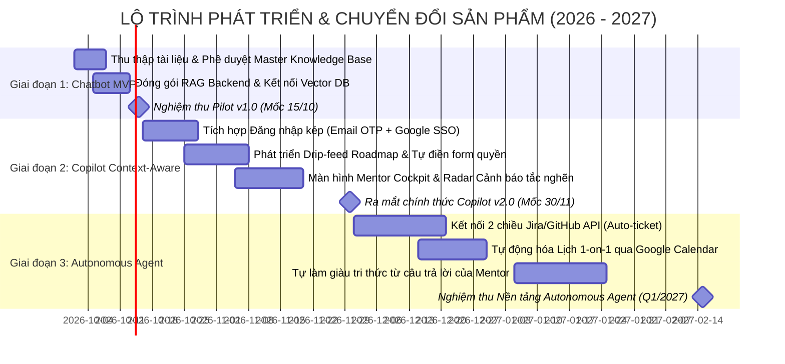

# ONBOARDING COPILOT & AUTONOMOUS AGENT
## TÀI LIỆU ĐẶC TẢ YÊU CẦU PHẦN MỀM (SRS) & THIẾT KẾ KIẾN TRÚC HỆ THỐNG THỰC TẾ
*Chuẩn tài liệu: IEEE 830 / ISO/IEC/IEEE 29148*  
*Phiên bản: 1.0 — Ngày lập: 30/09/2026*  
*Trạng thái: Đã phê duyệt kiến trúc mục tiêu*

---

## MỤC LỤC
1. [TỔNG QUAN DỰ ÁN & BỐI CẢNH](#1-tổng-quan-dự-án--bối-cảnh)
2. [SƠ ĐỒ KIẾN TRÚC HỆ THỐNG THẬT (PRODUCTION SYSTEM ARCHITECTURE)](#2-sơ-đồ-kiến-trúc-hệ-thống-thật-production-system-architecture)
   - 2.1. Sơ đồ kiến trúc tổng thể (High-Level Architecture - Mermaid)
   - 2.2. Sơ đồ luồng xử lý Agent & RAG Pipeline (Agent Execution Flow - Mermaid)
   - 2.3. Sơ đồ liên kết định danh kép (Dual-Identity Transition Flow - Mermaid)
3. [ĐẶC TẢ YÊU CẦU PHẦN MỀM (SRS - SOFTWARE REQUIREMENTS SPECIFICATION)](#3-đặc-tả-yêu-cầu-phần-mềm-srs)
   - 3.1. Các nhóm người dùng & Ma trận phân quyền (User Classes & RBAC)
   - 3.2. Yêu cầu chức năng chi tiết (Functional Requirements - FR)
   - 3.3. Yêu cầu phi chức năng (Non-Functional Requirements - NFR)
4. [THIẾT KẾ CƠ SỞ DỮ LIỆU THỰC TẾ (DATABASE SCHEMA DESIGN)](#4-thiết-kế-cơ-sở-dữ-liệu-thực-tế-database-schema-design)
5. [DANH MỤC CÔNG NGHỆ (TECH STACK) & HẠ TẦNG TRIỂN KHAI (INFRASTRUCTURE & DEVOPS)](#5-danh-mục-công-nghệ-tech-stack--hạ-tầng-triển-khai)
6. [LỘ TRÌNH TRIỂN KHAI & KẾ HOẠCH NÂNG CẤP (ROLLOUT PLAN)](#6-lộ-trình-triển-khai--kế-hoạch-nâng-cấp)

---

## 1. TỔNG QUAN DỰ ÁN & BỐI CẢNH

### 1.1. Tuyên bố bài toán (Problem Statement)
* **Khoảng trống Ngày 0 – Ngày 3:** Nhân sự mới gia nhập doanh nghiệp thường mất từ 24 đến 72 giờ để được cấp phát đầy đủ tài khoản nội bộ (Google Workspace, Active Directory, Slack). Trong thời gian này, họ hoàn toàn bị cô lập khỏi chatbot IT và hệ thống tài liệu nội bộ.
* **Tải sự vụ dồn lên Mentor:** 80% câu hỏi trong tuần đầu tiên là các câu hỏi thủ tục lặp lại (xin quyền Jira, lỗi máy tính, thuật ngữ viết tắt, quy chế chấm công), gây lãng phí từ 5–10 giờ làm việc/tuần của Senior Mentor.
* **Rủi ro trễ hạn thử việc:** Sự thiếu hụt thông tin dẫn đến việc cài đặt môi trường chậm, ticket xin quyền bị treo không rõ lý do, kéo dài thời gian đạt mức năng suất tiêu chuẩn (Time-to-Productivity).

### 1.2. Giải pháp: Onboarding Copilot & Autonomous Agent
Hệ thống phần mềm hỗ trợ hội nhập nhân sự mới xuyên suốt 30 ngày, hoạt động từ **Ngày 0** bằng email cá nhân + OTP và chuyển tiếp mượt mà sang tài khoản doanh nghiệp. Sản phẩm tiến hóa theo 3 cấp độ:
1. **Chatbot (Cơ bản):** Tra cứu tri thức chuẩn hóa (RAG), tự động trích dẫn nguồn (Source Card) và danh bạ hỗ trợ (Contact Card).
2. **Copilot (Ngữ cảnh):** Hiểu vị trí công việc, ngày onboarding hiện tại; lộ trình dạng Drip-feed mở khóa dần; tự động điền sẵn form xin quyền.
3. **Autonomous Agent (Tự chủ):** Tự động gọi API cấp quyền (Jira/GitHub), kiểm tra trạng thái cấp phát ngầm, tự động book lịch 1-on-1 với Mentor trên Calendar.

---

## 2. SƠ ĐỒ KIẾN TRÚC HỆ THỐNG THẬT (PRODUCTION SYSTEM ARCHITECTURE)

### 2.1. Sơ đồ kiến trúc tổng thể (High-Level Architecture)

Kiến trúc triển khai thực tế được xây dựng theo mô hình **Cloud-Native Microservices & Event-Driven Agentic System**:

---

### 2.2. Sơ đồ luồng xử lý Agent & RAG Pipeline (Agent Execution Flow)

Sơ đồ trình bày quy trình từ lúc người dùng gửi câu hỏi, qua bộ lọc an toàn, phân loại ý định (Intent), truy xuất tri thức và tự động gọi API công cụ:

---

### 2.3. Sơ đồ liên kết định danh kép (Dual-Identity Transition Flow)

Giải quyết bài toán then chốt: **Sử dụng từ Ngày 0 trước khi có tài khoản công ty**:

---

## 3. ĐẶC TẢ YÊU CẦU PHẦN MỀM (SRS)

### 3.1. Các nhóm người dùng & Ma trận phân quyền (User Classes & RBAC)

| Nhóm người dùng | Mô tả | Quyền hạn chính trên hệ thống |
| :--- | :--- | :--- |
| **Newcomer (Nhân sự mới)** | Nhân viên đang trong kỳ onboarding 30 ngày (sử dụng từ Ngày 0). | Hỏi đáp Copilot, đánh dấu checklist, xem tài liệu, tra thuật ngữ, gửi yêu cầu cấp quyền, gửi SOS. |
| **Mentor (Người đồng hành)** | Trưởng nhóm kỹ thuật, Senior phụ trách trực tiếp tân binh. | Xem bảng theo dõi Mentee, nhận cảnh báo tắc nghẽn, duyệt yêu cầu quyền 1-chạm, trả lời câu hỏi tồn đọng. |
| **HR / L&D Admin** | Quản trị viên nhân sự và đào tạo hội nhập. | Quản lý lộ trình (Roadmap stages), cập nhật chính sách nhân sự, theo dõi chỉ số hòa nhập toàn công ty. |
| **IT Helpdesk & System Admin** | Đội ngũ quản trị kỹ thuật và an toàn thông tin. | Quản lý danh mục tích hợp hệ thống (Jira, GitHub, VPN), cấu hình SLA, giám sát log truy cập và an toàn thông tin. |

---

### 3.2. Yêu cầu chức năng chi tiết (Functional Requirements - FR)

#### Module 1: Xác thực & Quản lý định danh (Authentication & Identity)
* **FR-1.1 (Day 0 OTP Authentication):** Hệ thống cho phép nhân sự mới đăng nhập bằng email cá nhân đã đăng ký với HR. Hệ thống gửi mã OTP gồm 6 chữ số có hiệu lực trong 5 phút.
* **FR-1.2 (Enterprise SSO Integration):** Hỗ trợ đăng nhập một chạm qua SAML 2.0 / OIDC (Google Workspace, Okta, Microsoft Azure AD).
* **FR-1.3 (Identity Merging):** Tự động liên kết dữ liệu tiến trình (checklist, lịch sử chat) từ tài khoản cá nhân sang tài khoản công ty khi hoàn tất đăng nhập SSO lần đầu.

#### Module 2: Trợ lý Hỏi đáp RAG & Trích dẫn Nguồn (Intelligent Q&A Assistant)
* **FR-2.1 (Semantic & Keyword Search):** Xử lý câu hỏi tự nhiên bằng tiếng Việt (chuẩn hóa có dấu và không dấu). Tìm kiếm kết hợp vector embedding và từ khóa BM25.
* **FR-2.2 (Source Attribution):** Mọi câu trả lời từ bot (ngoại trừ câu fallback) bắt buộc đính kèm **Source Card** thể hiện: Tên tài liệu trích dẫn, ngày cập nhật gần nhất, phòng ban phụ trách và liên kết mở trực tiếp.
* **FR-2.3 (Contact Resolution Card):** Đối với các câu hỏi về sự cố kỹ thuật hoặc lỗi thiết bị, bot hiển thị **Contact Card** với đầu mối xử lý, email nhóm chức năng, kênh hỗ trợ và thời gian cam kết SLA.
* **FR-2.4 (Feedback Loop):** Cho phép người dùng đánh giá câu trả lời với nút 👍 (Hữu ích) và 👎 (Chưa hài lòng). Phản hồi chưa hài lòng sẽ tự động đẩy vào danh mục rà soát của Mentor.
* **FR-2.5 (Escalation to Human):** Cung cấp nút "Hỏi người thật" trên mọi câu trả lời. Hệ thống tự động điền sẵn thông tin tóm tắt câu hỏi, người nhận đề xuất và gửi ticket thông báo.

#### Module 3: Lộ trình Hội nhập Phân đoạn (Drip-feed Onboarding Roadmap)
* **FR-3.1 (Multi-stage Timeline):** Hiển thị lộ trình trực quan chia thành 4 mốc: Ngày 1, Tuần 1, Tuần 2, Ngày 30.
* **FR-3.2 (Drip-feed Mechanism):** Khóa (Lock) các giai đoạn tương lai và hiển thị nhãn *"Mở vào Tuần 2"* nhằm tránh hiện tượng quá tải nhận thức (Cognitive Overload).
* **FR-3.3 (Dynamic Progress Calculation):** Thanh tiến độ (%) cập nhật thời gian thực ngay khi người dùng đánh dấu hoàn thành một đầu việc trên checklist.

#### Module 4: Cấp quyền Hệ thống & Tự động hóa Tác vụ (Access Management & Action Agent)
* **FR-4.1 (Access Catalog):** Cung cấp danh mục các hệ thống làm việc chuẩn: Jira, GitHub, Confluence, Email, VPN kèm trạng thái hiển thị: *Chưa có*, *Đang chờ duyệt*, *Đã có*.
* **FR-4.2 (Step-by-step Drawer):** Khi nhấn vào từng hệ thống, hiển thị drawer trượt chứa: quy trình từng bước, người duyệt quyền, thời gian xử lý tiêu chuẩn và liên kết mở form.
* **FR-4.3 (Automated API Action - Agent Tier):** Thay mặt người dùng gọi API IT Service Desk để mở ticket xin quyền và tự động cập nhật trạng thái khi ticket được duyệt thành công.

#### Module 5: Từ điển Thuật ngữ & Kỹ thuật Ghi nhớ (Interactive Glossary & Retention)
* **FR-5.1 (In-text Dotted Underline):** Tự động phát hiện các thuật ngữ chuyên môn nội bộ (RASCI, Dispatching, Matching, WPS, CM, SOP, PR, SLA...) trong đoạn hội thoại của bot và hiển thị gạch chân nét chấm.
* **FR-5.2 (Instant Hover/Tap Tooltip):** Khi rê chuột (trên Desktop) hoặc chạm (trên Mobile), hiển thị tooltip chứa định nghĩa ngắn gọn, tên đầy đủ và thẻ dự án.
* **FR-5.3 (Glossary Hub):** Màn hình tra cứu từ điển độc lập hỗ trợ tìm kiếm từ khóa, bộ lọc ký tự A-Z và lọc theo dự án (*Chung*, *GSM*).

#### Module 6: Danh bạ Giải quyết Vấn đề (Search by Problem Directory)
* **FR-6.1 (Problem-based Querying):** Cho phép tìm kiếm danh bạ theo mô tả vấn đề (ví dụ: *"hỏng wifi"*, *"chấm công thiếu"*, *"thẻ gửi xe"*) thay vì phải tìm kiếm theo tên nhân viên.
* **FR-6.2 (Action Shortcuts):** Thẻ danh bạ cung cấp nút tắt "Mở chat hỗ trợ" và "Soạn email nhanh" với tiêu đề và nội dung được điền sẵn thông tin tân binh.

#### Module 7: Sơ đồ Tổ chức Tương tác (Interactive Org Chart)
* **FR-7.1 (Hierarchical Tree):** Cây phân cấp 3 tầng có thể đóng/mở linh hoạt: Khối ➔ Phòng ban ➔ Team chuyên trách.
* **FR-7.2 ("My Team" Focus):** Nút *"Team của tôi"* tự động kích hoạt hiệu ứng mở rộng đúng nhánh phòng ban và viền sáng làm nổi bật vị trí làm việc của tân binh.
* **FR-7.3 (Department Details Sheet):** Bảng chi tiết bên phải hiển thị chức năng nhiệm vụ, trưởng bộ phận, các dự án trọng điểm đang chạy và email đầu mối.

#### Module 8: Bảng Điều khiển Giám sát cho Mentor & HR (Mentor Oversight Cockpit)
* **FR-8.1 (Mentee Progress Tracking):** Danh sách tân binh kèm ngày bắt đầu, % hoàn thành checklist và thời điểm hoạt động gần nhất.
* **FR-8.2 (Smart Bottleneck Warnings):** Thuật toán tự động gắn nhãn cảnh báo:
  * Nhãn vàng: *"Đang chậm tiến độ"* (ví dụ: quá 3 ngày chưa xong cấu hình máy).
  * Nhãn đỏ: *"Hỏi lặp lại nhiều lần"* (ví dụ: hỏi trên 3 lần về lỗi quyền GitHub/VPN).
* **FR-8.3 (Knowledge Gap Triage):** Danh sách các câu hỏi thực tế của tân binh bị rơi vào fallback, kèm số lần lặp lại, cho phép Mentor duyệt và bổ sung câu trả lời trực tiếp vào kho tri thức.

---

### 3.3. Yêu cầu phi chức năng (Non-Functional Requirements - NFR)

#### 1. Hiệu năng & Tốc độ phản hồi (Performance)
* **Thời gian sinh từ đầu tiên (Time To First Token - TTFT):** Dưới **800ms** đối với câu trả lời streaming của AI.
* **Độ trễ tải trang (Page Load Time):** Điểm Google Lighthouse Performance đạt **≥ 90**; thời gian tải trang đầu tiên (FCP) dưới **1.2 giây**.
* **Tìm kiếm RAG:** Thời gian truy xuất tài liệu và rerank đạt dưới **300ms** trên kho dữ liệu 100.000 chunks.

#### 2. Khả năng mở rộng & Tải đồng thời (Scalability & Concurrency)
* **Khả năng chịu tải:** Hỗ trợ tối thiểu **1.000 người dùng trực tuyến đồng thời (CCU)** trong các đợt tuyển dụng cao điểm không bị gián đoạn.
* **Auto-scaling:** Cụm Backend Pods và RAG Service tự động co giãn dựa trên ngưỡng sử dụng CPU > 70% hoặc độ dài hàng đợi tin nhắn.

#### 3. Bảo mật & Bảo vệ quyền riêng tư (Security & Compliance)
* **Mã hóa dữ liệu:** Toàn bộ dữ liệu truyền tải bắt buộc dùng **TLS 1.3**. Dữ liệu lưu trữ (Database, Vector DB, S3) được mã hóa bằng chuẩn **AES-256**.
* **Zero PII Leakage:** Module Guardrails tự động phát hiện và che giấu (masking) các thông tin nhạy cảm: Số CCCD, số thẻ ngân hàng, mật khẩu trước khi gửi tới mô hình ngôn ngữ lớn (LLM).
* **Kiểm toán hoạt động (Audit Trail):** Ghi vết 100% các hành động: đăng nhập OTP, phân quyền hệ thống, sửa đổi tài liệu và xuất log lưu trữ tối thiểu 365 ngày.

#### 4. Độ sẵn sàng & Khả năng phục hồi (Availability & Reliability)
* **Cam kết SLA:** Độ sẵn sàng hệ thống đạt **99.9%** (thời gian chết không quá 43 phút/tháng).
* **Cơ chế Fallback nhiều tầng:** Khi LLM chính gặp sự cố timeout (> 3s), hệ thống tự động chuyển sang mô hình LLM dự phòng hoặc trả về kết quả tìm kiếm tài liệu thô dựa trên từ khóa.

---

## 4. THIẾT KẾ CƠ SỞ DỮ LIỆU THỰC TẾ (DATABASE SCHEMA DESIGN)

Mô hình dữ liệu quan hệ được tối ưu hóa cho PostgreSQL:

---

## 5. DANH MỤC CÔNG NGHỆ (TECH STACK) & HẠ TẦNG TRIỂN KHAI

### 5.1. Tech Stack tiêu chuẩn doanh nghiệp

| Thành phần | Công nghệ đề xuất | Lý do lựa chọn |
| :--- | :--- | :--- |
| **Frontend Framework** | **React 19 / Next.js (App Router)** | Hiệu năng cao, SEO tốt, khả năng render Server-side (SSR) và đóng gói PWA trên điện thoại. |
| **Styling & Components** | **Tailwind CSS v4 + Radix UI Primitives** | Tùy biến linh hoạt, kích thước bundle tối ưu, hỗ trợ khả năng truy cập (Accessibility WAI-ARIA) chuẩn mực. |
| **Backend API Core** | **NestJS (Node.js) hoặc FastAPI (Python)** | NestJS cho kiến trúc module hướng đối tượng rõ ràng; FastAPI cho khả năng xử lý bất đồng bộ AI/Data khoa học. |
| **Agentic Framework** | **LangGraph / CrewAI** | Hỗ trợ mô hình State Machine đa tác nhân (Multi-Agent), kiểm soát luồng rẽ nhánh và gọi công cụ (Tool Calling) chính xác. |
| **LLM Inference** | **Google Gemini 1.5 Pro / GPT-4o** | Cửa sổ ngữ cảnh lớn (1M tokens), xử lý tiếng Việt xuất sắc, chi phí tối ưu trên mỗi token. |
| **Vector Database** | **Qdrant (hoặc pgvector trên PostgreSQL)** | Hiệu năng tìm kiếm tương đồng vector siêu nhanh, hỗ trợ lọc metadata phong phú và tự host dễ dàng. |
| **RAG Ingestion** | **LlamaIndex** | Xử lý tài liệu PDF, DOCX, Markdown phân đoạn thông minh, giữ nguyên bảng biểu cấu trúc. |
| **Primary Database** | **PostgreSQL 16 (AWS RDS / Cloud SQL)** | Ổn định, hỗ trợ JSONB mạnh mẽ, quan hệ dữ liệu toàn vẹn và tích hợp pgvector khi cần. |
| **In-Memory Cache** | **Redis Cluster** | Quản lý phiên làm việc, stream tin nhắn chat qua Server-Sent Events (SSE) và rate limiting. |

---

### 5.2. Sơ đồ hạ tầng triển khai Cloud & CI/CD (Infrastructure Topology)

---

## 6. LỘ TRÌNH TRIỂN KHAI & KẾ HOẠCH NÂNG CẤP (ROLLOUT PLAN)

---

## 7. TIÊU CHÍ ĐO LƯỜNG THÀNH CÔNG (SUCCESS METRICS & KPIS)

1. **Tỷ lệ giải quyết tự động (Deflection Rate):**
   * Giảm **≥ 70%** số lượng câu hỏi về thủ tục/phân quyền gửi thủ công đến Mentor và IT Helpdesk trong 7 ngày đầu của nhân sự.
2. **Thời gian hoàn thành cấp quyền (Access Lead Time):**
   * Rút ngắn thời gian từ lúc nhân sự yêu cầu đến khi nhận quyền GitHub/Jira/VPN từ **48 giờ** xuống còn dưới **8 giờ**.
3. **Mức độ gắn kết với Lộ trình (Roadmap Adherence):**
   * **≥ 90%** tân binh hoàn thành 100% checklist Ngày 1 và Tuần 1 đúng hạn.
4. **Độ hài lòng hội nhập (Onboarding CSAT / NPS):**
   * Điểm đánh giá trải nghiệm hội nhập từ nhân sự mới đạt tối thiểu **4.5 / 5.0**.
